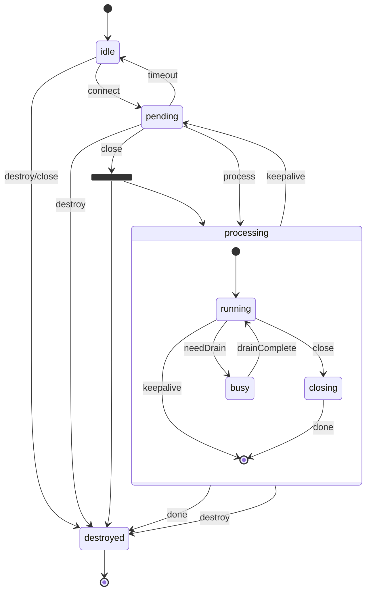

# Client Lifecycle

An Undici [Client](Client.md) can be best described as a state machine. The following list is a summary of the various state transitions the `Client` will go through in its lifecycle. This document also contains detailed breakdowns of each state.

> This diagram is not a perfect representation of the undici Client. Since the Client class is not actually implemented as a state-machine, actual execution may deviate slightly from what is described below. Consider this as a general resource for understanding the inner workings of the Undici client rather than some kind of formal specification.

## State Transition Overview

* A `Client` begins in the **idle** state with no socket connection and no requests in queue.
  * The *connect* event transitions the `Client` to the **pending** state where requests can be queued prior to processing.
  * The *close* and *destroy* events transition the `Client` to the **destroyed** state. Since there are no requests in the queue, the *close* event immediately transitions to the **destroyed** state.
* The **pending** state indicates the underlying socket connection has been successfully established and requests are queueing.
  * The *process* event transitions the `Client` to the **processing** state where requests are processed.
  * If requests are queued, the *close* event transitions to the **processing** state; otherwise, it transitions to the **destroyed** state.
  * The *destroy* event transitions to the **destroyed** state.
* The **processing** state initializes to the **processing.running** state.
  * If the current request requires draining, the *needDrain* event transitions the `Client` into the **processing.busy** state which will return to the **processing.running** state with the *drainComplete* event.
  * After all queued requests are completed, the *keepalive* event transitions the `Client` back to the **pending** state. If no requests are queued during the timeout, the **close** event transitions the `Client` to the **destroyed** state.
  * If the *close* event is fired while the `Client` still has queued requests, the `Client` transitions to the **process.closing** state where it will complete all existing requests before firing the *done* event.
  * The *done* event gracefully transitions the `Client` to the **destroyed** state.
  * At any point in time, the *destroy* event will transition the `Client` from the **processing** state to the **destroyed** state, destroying any queued requests.
* The **destroyed** state is a final state and the `Client` is no longer functional.

A state diagram representing an Undici Client instance:

## State details

### idle

The **idle** state is the initial state of a `Client` instance. While an `origin` is required for instantiating a `Client` instance, the underlying socket connection will not be established until a request is queued using [`Client.dispatch()`](Client.md#clientdispatchoptions-handlers). By calling `Client.dispatch()` directly or using one of the multiple implementations ([`Client.connect()`](Client.md#clientconnectoptions-callback), [`Client.pipeline()`](Client.md#clientpipelineoptions-handler), [`Client.request()`](Client.md#clientrequestoptions-callback), [`Client.stream()`](Client.md#clientstreamoptions-factory-callback), and [`Client.upgrade()`](Client.md#clientupgradeoptions-callback)), the `Client` instance will transition from **idle** to [**pending**](#pending) and then most likely directly to [**processing**](#processing).

Calling [`Client.close()`](Client.md#clientclosecallback) or [`Client.destroy()`](Client.md#clientdestroyerror-callback) transitions directly to the [**destroyed**](#destroyed) state since the `Client` instance will have no queued requests in this state.

### pending

The **pending** state signifies a non-processing `Client`. Upon entering this state, the `Client` establishes a socket connection and emits the [`'connect'`](Client.md#event-connect) event signalling a connection was successfully established with the `origin` provided during `Client` instantiation. The internal queue is initially empty, and requests can start queueing.

Calling [`Client.close()`](Client.md#clientclosecallback) with queued requests, transitions the `Client` to the [**processing**](#processing) state. Without queued requests, it transitions to the [**destroyed**](#destroyed) state.

Calling [`Client.destroy()`](Client.md#clientdestroyerror-callback) transitions directly to the [**destroyed**](#destroyed) state regardless of existing requests.

### processing

The **processing** state is a state machine within itself. It initializes to the [**processing.running**](#running) state. The [`Client.dispatch()`](Client.md#clientdispatchoptions-handlers), [`Client.close()`](Client.md#clientclosecallback), and [`Client.destroy()`](Client.md#clientdestroyerror-callback) can be called at any time while the `Client` is in this state. `Client.d